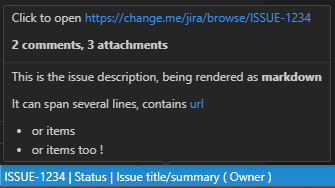

# Jira Quick Info

Small extension to display a Jira's summary, status and owner in the status bar.
Clicking on it will open the issue webpage.

## Requirement
You'll need to set up a Personnal Access Token to authenticate to Jira.
Look for more information in your Jira's profile.

# Options & Commands
The extension provides 4 commands:
* Change issue: change the issue label to use. By default, this is the current workspace Folder.
* Set paths: when default label is used, sets a list of path where this extension is active.
* Open in browser: call your default browser to view the current selected issue.
* Removes all thumbnails images: delete all images thumbnails downloaded in your vscode app folder for previewing.

Theses commands are linked with 4 settings with different scopes:
* [Workspace] Issue: the jira you want to fetch
* [Machine] Token path: the path to your PAT to authenticate
* [Machine] Url: base url of your jira instance
* [Machine] Paths: Whitelist of paths where extension must be active with the default label.

# Changelog

## [0.1.2] 2026-02-12
- take correct parent and convert \ to / in paths
